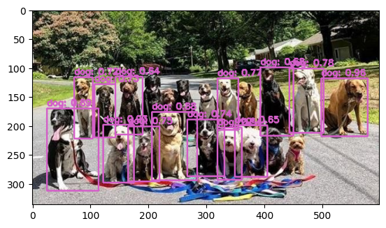
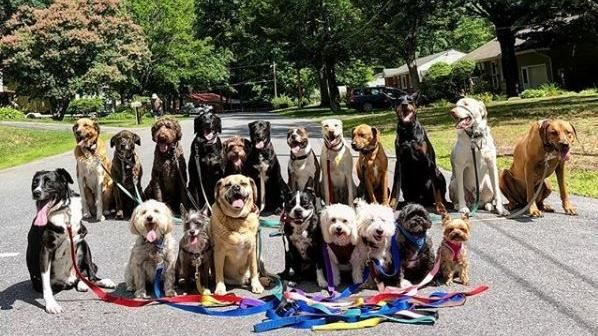

# YOLOv4 Object Detection using Pre-trained Model

This repository contains a Python notebook demonstrating how to perform object detection using a pre-trained YOLOv4 model. YOLO (You Only Look Once) is a popular deep learning algorithm for real-time object detection. YOLOv4 is an improved version of the YOLO algorithm, offering better accuracy and speed.

## About YOLOv4

YOLOv4 stands for You Only Look Once version 4. It is a state-of-the-art object detection model that achieves high accuracy and fast inference times. YOLOv4 improves upon its predecessors by incorporating various advancements in deep learning, such as feature pyramid networks, bag-of-freebies techniques, and improved data augmentation strategies. These enhancements enable YOLOv4 to detect objects with greater precision across a wide range of classes while maintaining real-time performance.

## Notebook Overview

The provided notebook demonstrates how to utilize a pre-trained YOLOv4 model for object detection tasks. It covers the following steps:

1. Downloading the pre-trained YOLOv4 weights and configuration files.
2. Loading the YOLOv4 model using OpenCV's `dnn` module.
3. Preprocessing an input image for inference.
4. Performing object detection on the input image using the YOLOv4 model.
5. Post-processing the detection results, including non-maximum suppression (NMS) to filter out overlapping bounding boxes.
6. Displaying the detected objects on the original image.

## Usage

1. Ensure you have all dependencies installed, including OpenCV (`cv2`), NumPy (`numpy`), and Matplotlib (`matplotlib`).
2. Download the YOLOv4 weights (`yolov4.weights`) and configuration file (`yolov4.cfg`) from the provided links or use your own.
3. Run the notebook to perform object detection on an input image.
4. View the output, which includes the original image with bounding boxes drawn around detected objects.

## Result

## Original Image

## Conclusion

This notebook provides a practical example of using a pre-trained YOLOv4 model for object detection tasks. By leveraging the power of deep learning and state-of-the-art algorithms like YOLOv4, we can accurately and efficiently detect objects in images, opening up possibilities for various applications in computer vision and beyond.
